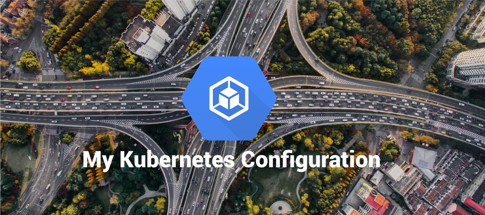

# K8S Infrastructure



## Installation and configuration

### Environment

```
CentOS Linux Release 7.6.1810 64bit
Docker version 18.06.1-ce Git commit: e68fc7a
Kubernetes version: v1.14.3
```

```
Hostname          IP            Role
SRV-K8S-MASTER01  172.16.5.211  k8s master node
SRV-K8S-WORKER01  172.16.5.213  k8s slave node
SRV-K8S-WORKER02  172.16.5.214  k8s slave node
```

### Prerequisites

Setup network on CentOS 7

Update source

```
yum clean all
yum makecache
yum update
```

Close firewall on all nodes

```
systemctl stop firewalld
systemctl disable firewalld
```

Disable SELINUX on all nodes
```
setenforce 0

vi /etc/selinux/config
SELINUX=disabled
```

Disable swap on all nodes

```
swapoff -a
```

Comment swap autoload config in the `/etc/fstab` file and varify with `free -m`.

Add following content on each /etc/hosts file

```
172.16.5.211 SRV-K8S-MASTER01
172.16.5.213 SRV-K8S-WORKER01
172.16.5.214 SRV-K8S-WORKER02
```

Create `/etc/sysctl.d/k8s.conf` file

```
net.bridge.bridge-nf-call-ip6tables = 1
net.bridge.bridge-nf-call-iptables = 1
net.ipv4.ip_forward = 1
vm.swappiness = 0
```

Take change effect

```
modprobe br_netfilter
sysctl -p /etc/sysctl.d/k8s.conf
```

Install recommended ipvs management tools

```
yum -y install ipset ipvsadm
```

Open kernel ipvs modules for kube-proxy

```
cat > /etc/sysconfig/modules/ipvs.modules <<EOF
#!/bin/bash
modprobe -- ip_vs
modprobe -- ip_vs_rr
modprobe -- ip_vs_wrr
modprobe -- ip_vs_sh
modprobe -- nf_conntrack_ipv4
EOF
chmod 755 /etc/sysconfig/modules/ipvs.modules && bash /etc/sysconfig/modules/ipvs.modules && lsmod | grep -e ip_vs -e nf_conntrack_ipv4
```

### Setup Docker

```
yum install -y yum-utils device-mapper-persistent-data lvm2
yum-config-manager \
    --add-repo \
    https://download.docker.com/linux/centos/docker-ce.repo
```

Install and lanuch Docker on each nodes

```
yum install docker-ce docker-ce-cli containerd.io

systemctl start docker
systemctl enable docker
```

### Setup Kubernetes

Install kubelet, kubectl and kubeadm on each node

```
cat <<EOF > /etc/yum.repos.d/kubernetes.repo
[kubernetes]
name=Kubernetes
baseurl=https://packages.cloud.google.com/yum/repos/kubernetes-el7-x86_64
enabled=1
gpgcheck=1
repo_gpgcheck=1
gpgkey=https://packages.cloud.google.com/yum/doc/yum-key.gpg
        https://packages.cloud.google.com/yum/doc/rpm-package-key.gpg
EOF
```

Installation

```
yum makecache fast
yum install -y kubelet kubeadm kubectl
```

Init Kubernetes cluster on master node

```
# auto start on boot
systemctl enable kubelet && systemctl start kubelet
kubeadm init --config /opt/k8s/kubeadm-init.conf
````

Detailed cluster initialization process

```
[root@SRV-K8S-MASTER01 k8s]# kubeadm init --config kubeadm-init.conf
[init] Using Kubernetes version: v1.14.3
[preflight] Pulling images required for setting up a Kubernetes cluster
[preflight] This might take a minute or two, depending on the speed of your internet connection
[preflight] You can also perform this action in beforehand using 'kubeadm config images pull'
[kubelet-start] Writing kubelet environment file with flags to file "/var/lib/kubelet/kubeadm-flags.env"
[kubelet-start] Writing kubelet configuration to file "/var/lib/kubelet/config.yaml"
[kubelet-start] Activating the kubelet service
[certs] Using certificateDir folder "/etc/kubernetes/pki"
[certs] Generating "front-proxy-ca" certificate and key
[certs] Generating "front-proxy-client" certificate and key
[certs] Generating "etcd/ca" certificate and key
[certs] Generating "etcd/healthcheck-client" certificate and key
[certs] Generating "apiserver-etcd-client" certificate and key
[certs] Generating "etcd/server" certificate and key
[certs] etcd/server serving cert is signed for DNS names [srv-k8s-master01.netboot.lan localhost] and IPs [172.16.5.211 127.0.0.1 ::1]
[certs] Generating "etcd/peer" certificate and key
[certs] etcd/peer serving cert is signed for DNS names [srv-k8s-master01.netboot.lan localhost] and IPs [172.16.5.211 127.0.0.1 ::1]
[certs] Generating "ca" certificate and key
[certs] Generating "apiserver-kubelet-client" certificate and key
[certs] Generating "apiserver" certificate and key
[certs] apiserver serving cert is signed for DNS names [srv-k8s-master01.netboot.lan kubernetes kubernetes.default kubernetes.default.svc kubernetes.default.svc.cluster.local] and IPs [10                                                  .96.0.1 172.16.5.211]
[certs] Generating "sa" key and public key
[kubeconfig] Using kubeconfig folder "/etc/kubernetes"
[kubeconfig] Writing "admin.conf" kubeconfig file
[kubeconfig] Writing "kubelet.conf" kubeconfig file
[kubeconfig] Writing "controller-manager.conf" kubeconfig file
[kubeconfig] Writing "scheduler.conf" kubeconfig file
[control-plane] Using manifest folder "/etc/kubernetes/manifests"
[control-plane] Creating static Pod manifest for "kube-apiserver"
[control-plane] Creating static Pod manifest for "kube-controller-manager"
[control-plane] Creating static Pod manifest for "kube-scheduler"
[etcd] Creating static Pod manifest for local etcd in "/etc/kubernetes/manifests"
[wait-control-plane] Waiting for the kubelet to boot up the control plane as static Pods from directory "/etc/kubernetes/manifests". This can take up to 4m0s
[apiclient] All control plane components are healthy after 15.502251 seconds
[upload-config] storing the configuration used in ConfigMap "kubeadm-config" in the "kube-system" Namespace
[kubelet] Creating a ConfigMap "kubelet-config-1.14" in namespace kube-system with the configuration for the kubelets in the cluster
[upload-certs] Skipping phase. Please see --experimental-upload-certs
[mark-control-plane] Marking the node srv-k8s-master01.netboot.lan as control-plane by adding the label "node-role.kubernetes.io/master=''"
[mark-control-plane] Marking the node srv-k8s-master01.netboot.lan as control-plane by adding the taints [node-role.kubernetes.io/master:NoSchedule]
[bootstrap-token] Using token: dx42vx.5u8emct7bvz6l2kv
[bootstrap-token] Configuring bootstrap tokens, cluster-info ConfigMap, RBAC Roles
[bootstrap-token] configured RBAC rules to allow Node Bootstrap tokens to post CSRs in order for nodes to get long term certificate credentials
[bootstrap-token] configured RBAC rules to allow the csrapprover controller automatically approve CSRs from a Node Bootstrap Token
[bootstrap-token] configured RBAC rules to allow certificate rotation for all node client certificates in the cluster
[bootstrap-token] creating the "cluster-info" ConfigMap in the "kube-public" namespace
[addons] Applied essential addon: CoreDNS
[addons] Applied essential addon: kube-proxy

Your Kubernetes control-plane has initialized successfully!

To start using your cluster, you need to run the following as a regular user:

  mkdir -p $HOME/.kube
  sudo cp -i /etc/kubernetes/admin.conf $HOME/.kube/config
  sudo chown $(id -u):$(id -g) $HOME/.kube/config

You should now deploy a pod network to the cluster.
Run "kubectl apply -f [podnetwork].yaml" with one of the options listed at:
  https://kubernetes.io/docs/concepts/cluster-administration/addons/

Then you can join any number of worker nodes by running the following on each as root:

kubeadm join 172.16.5.211:6443 --token dx42vx.5u8emct7bvz6l2kv --discovery-token-ca-cert-hash sha256:de880889c87fcc683be095bac569bafaaeb80bbdff89307f0afb9398d5199983
```

Config kubectl on the master node

```
mkdir -p $HOME/.kube
sudo cp -i /etc/kubernetes/admin.conf $HOME/.kube/config
sudo chown $(id -u):$(id -g) $HOME/.kube/config
````

### Install Pod networks

Download pod networks config file kube-flannel.yml and create pod networks by follwing command

```
kubectl apply -f kubectl apply -f /opt/k8s/kube-system/weave-net*.yaml 
```

If execute success, checked CoreDNS Pod running status

```
kubectl get pod --all-namespaces -owide --watch
```

Check Kubernetes master status to check ready

```
kubectl get nodes
NAME              STATUS   ROLES    AGE   VERSION
srv-k8s-master01  Ready    master   21m   v1.14.3
```

### Slave node configuration

Add slave nodes, run following command on each slave node

```
kubeadm join 172.16.5.211:6443 --token dx42vx.5u8emct7bvz6l2kv --discovery-token-ca-cert-hash sha256:de880889c87fcc683be095bac569bafaaeb80bbdff89307f0afb9398d5199983
```

If you forget token, run following command on master node

```
kubeadm token list
```

### Status validation

Run following commands on the master node

```
kubectl get nodes
NAME               STATUS   ROLES    AGE    VERSION
srv-k8s-master01   Ready    master   13m    v1.14.3
srv-k8s-worker01   Ready    <none>   107s   v1.14.3
srv-k8s-worker01   Ready    <none>   91s    v1.14.3
```
